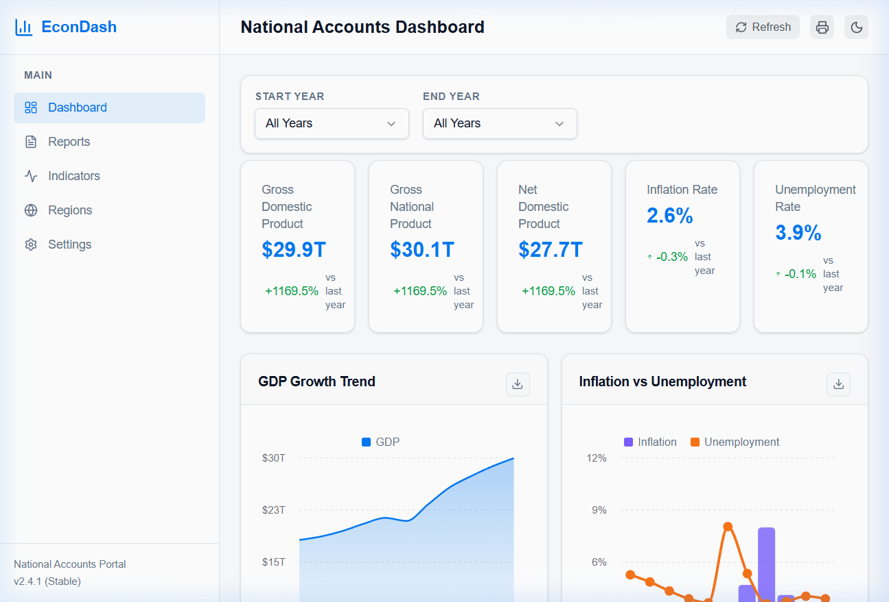
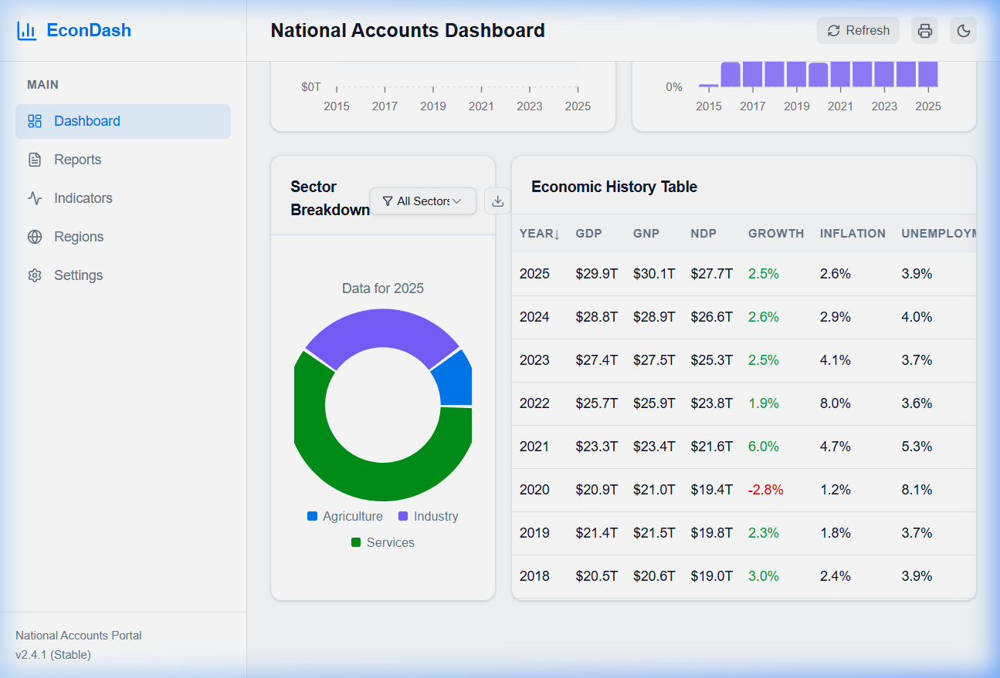

# 📊 National Accounts Explorer

> An interactive, full-stack economic data visualization dashboard for exploring national accounting indicators including GDP, GNP, NDP, Inflation, and Unemployment (2015–2025).

---

## 🌟 Features

### Dashboard
- **KPI Cards** — At-a-glance view of GDP ($29.9T), GNP ($30.1T), NDP ($27.7T), Inflation (2.6%), and Unemployment (3.9%) with year-over-year change indicators
- **GDP Growth Trend** — Interactive area chart showing GDP trajectory from 2015–2025
- **Inflation vs Unemployment** — Composed bar + line chart comparing the two key labor/price indicators
- **Sector Breakdown** — Donut chart showing Agriculture, Industry, and Services contribution to GDP
- **Economic History Table** — Sortable data table with all indicators, powered by TanStack Table
- **Year Range Filters** — Start/End year selectors that dynamically filter all charts and tables
- **CSV Export** — Download any chart's data as CSV with one click

### Reports
- Pre-built report templates (GDP Summary, National Accounts, Price & Labor, Full Dataset)
- Decade highlights with peak/trough identification
- Full data preview table with one-click CSV export

### Indicators
- Individual trend charts for GDP Growth Rate, Inflation Rate, Unemployment Rate, and NDP
- Combined multi-line overlay chart for cross-indicator comparison

### Sector Analysis (Regions)
- Year-selectable sector KPI cards (Agriculture, Industry, Services)
- Pie chart for sector share breakdown
- Percentage trend line chart over the full decade
- Stacked bar chart for absolute sector values over time

### Settings
- 🌙 Dark/Light mode toggle with persistence
- Compact mode, chart animations toggle
- Currency display preferences (USD, EUR, GBP, JPY)
- Default year range configuration

---

## 🛠️ Tech Stack

| Layer | Technology |
|-------|-----------|
| **Monorepo** | pnpm Workspaces |
| **Frontend** | React 19 + TypeScript 5.9 |
| **Build Tool** | Vite 7 |
| **Styling** | Tailwind CSS v4 |
| **UI Components** | Radix UI + shadcn/ui |
| **Charts** | Recharts |
| **Data Tables** | TanStack React Table |
| **State/Fetching** | TanStack React Query |
| **Routing** | Wouter |
| **API Framework** | Express 5 (Node.js) |
| **Validation** | Zod v4 |
| **API Codegen** | Orval (OpenAPI → React hooks) |
| **Bundler (Server)** | esbuild |
| **Logging** | Pino + pino-pretty |

---

## 📁 Project Structure

```
National-Acc-Explorer/
├── artifacts/
│   ├── api-server/              # Express API server
│   │   ├── src/
│   │   │   ├── index.ts         # Server entry point (port binding)
│   │   │   ├── app.ts           # Express app setup
│   │   │   ├── routes/
│   │   │   │   ├── economic.ts  # All economic data endpoints
│   │   │   │   └── health.ts    # Health check endpoint
│   │   │   ├── middlewares/     # CORS, logging middleware
│   │   │   └── lib/             # Logger configuration
│   │   └── build.mjs            # esbuild config
│   │
│   └── national-accounts/       # React frontend dashboard
│       ├── src/
│       │   ├── App.tsx           # Root component with routing
│       │   ├── main.tsx          # React entry point
│       │   ├── index.css         # Global styles + Tailwind
│       │   ├── pages/
│       │   │   ├── Dashboard.tsx # Main dashboard with KPIs & charts
│       │   │   ├── Reports.tsx   # Data export reports page
│       │   │   ├── Indicators.tsx# Individual indicator charts
│       │   │   ├── Regions.tsx   # Sector analysis page
│       │   │   └── Settings.tsx  # App preferences
│       │   └── components/
│       │       ├── Header.tsx    # Top navigation bar
│       │       ├── Sidebar.tsx   # Side navigation
│       │       ├── Layout.tsx    # Page layout wrapper
│       │       └── ui/           # 55 shadcn/ui components
│       └── vite.config.ts       # Vite + Tailwind + proxy config
│
├── lib/
│   ├── api-spec/                # OpenAPI specification (YAML)
│   ├── api-zod/                 # Generated Zod validation schemas
│   ├── api-client-react/        # Generated React Query hooks
│   └── db/                      # Database schema (Drizzle ORM)
│
├── scripts/                     # Build/utility scripts
├── package.json                 # Root workspace config
├── pnpm-workspace.yaml          # Workspace packages + catalog
└── tsconfig.base.json           # Shared TypeScript config
```

---

## 🚀 Getting Started

### Prerequisites

- **Node.js** ≥ 24.x
- **pnpm** ≥ 10.x

### Installation

```bash
# Clone the repository
git clone <repository-url>
cd National-Acc-Explorer

# Install dependencies
pnpm install
```

### Running Locally

You need **two terminals**:

**Terminal 1 — API Server (port 8080):**
```bash
pnpm --filter @workspace/api-server run dev
```

**Terminal 2 — Frontend (port 5173):**
```bash
pnpm --filter @workspace/national-accounts run dev
```

Then open **http://localhost:5173** in your browser.

> **Note:** The frontend automatically proxies `/api` requests to the backend at `localhost:8080`.

### Building for Production

```bash
pnpm run build
```

---

## 🔌 API Endpoints

| Method | Endpoint | Description |
|--------|----------|-------------|
| `GET` | `/api/economic-data` | All economic records. Supports `?startYear=` and `?endYear=` query params |
| `GET` | `/api/economic-data/summary` | Latest year KPI summary with year-over-year changes |
| `GET` | `/api/economic-data/sectors` | Sector breakdown (Agriculture/Industry/Services). Supports `?year=` |
| `GET` | `/api/economic-data/trends` | All trend data for charts + available years list |
| `GET` | `/api/healthz` | Health check |

### Example Response — `/api/economic-data/summary`

```json
{
  "latestYear": 2025,
  "gdp": 29950.0,
  "gnp": 30108.3,
  "ndp": 27680.4,
  "inflationRate": 2.6,
  "unemploymentRate": 3.9,
  "gdpGrowthRate": 2.5,
  "gdpChange": 1169.5,
  "inflationChange": -0.3,
  "unemploymentChange": -0.15
}
```

---

## 📋 Available Scripts

| Command | Description |
|---------|-------------|
| `pnpm install` | Install all workspace dependencies |
| `pnpm run build` | TypeScript check + build all packages |
| `pnpm run typecheck` | Run TypeScript checks across workspace |
| `pnpm --filter @workspace/api-server run dev` | Start API server |
| `pnpm --filter @workspace/national-accounts run dev` | Start frontend dev server |
| `pnpm --filter @workspace/api-spec run codegen` | Regenerate API hooks from OpenAPI spec |

---

## 📸 Screenshots

### Dashboard — KPI Cards & Charts


### Dashboard — Sector Breakdown & Data Table


---

## 📄 License

MIT

---

## 👥 Authors

National Accounts Dashboard — v2.4.1 (Stable)  
Data Coverage: 2015–2025
